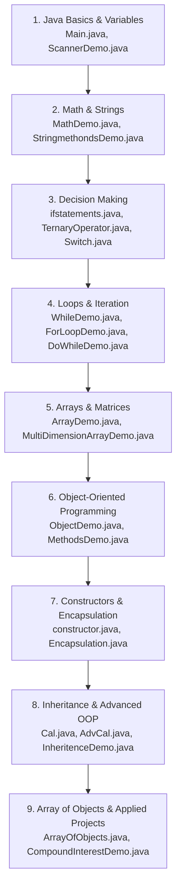

# Java Practice & Learning Repository

A comprehensive collection of beginner to intermediate Java practice programs. This repository covers foundational syntax, user input handling, string manipulation, mathematical calculations, control flow structures, loops, arrays, and core Object-Oriented Programming (OOP) principles.

---

## 📑 Table of Contents

- [Overview](#overview)
- [Project Structure](#project-structure)
- [Program Catalog](#program-catalog)
  - [1. Basics & Input/Output](#1-basics--inputoutput)
  - [2. Mathematical & String Operations](#2-mathematical--string-operations)
  - [3. Control Flow & Decision Making](#3-control-flow--decision-making)
  - [4. Loops & Iterations](#4-loops--iterations)
  - [5. Arrays & Data Structures](#5-arrays--data-structures)
  - [6. Object-Oriented Programming (OOP)](#6-object-oriented-programming-oop)
- [Formulas & Key Implementations](#formulas--key-implementations)
- [How to Run the Programs](#how-to-run-the-programs)
- [Recommended Learning Roadmap](#recommended-learning-roadmap)

---

## 🌟 Overview

This repository serves as a hands-on learning lab for Java development. It contains **31 standalone Java source files** in the `src/` directory, systematically illustrating the transition from writing basic procedural code to structured object-oriented software.

---

## 📁 Project Structure

```text
My First Java code/
├── .idea/                  # IntelliJ IDEA project configuration
├── out/                    # Compiled .class build output
├── src/                    # Java source files (.java)
│   ├── AdvCal.java
│   ├── ArrayDemo.java
│   ├── ArrayOfObjects.java
│   ├── Cal.java
│   ├── CompoundInterestDemo.java
│   ├── constructor.java
│   ├── DoWhileDemo.java
│   ├── Encapsulation.java
│   ├── EvenorOdd.java
│   ├── ForLoopDemo.java
│   ├── ifstatements.java
│   ├── InheritenceDemo.java
│   ├── MadlibDemo.java
│   ├── Main.java
│   ├── MathDemo.java
│   ├── MathProject.java
│   ├── MethodsDemo.java
│   ├── MultiDimensionArrayDemo.java
│   ├── MyFirstProject.java
│   ├── NestedDemo.java
│   ├── NestedStatements.java
│   ├── ObjectDemo.java
│   ├── ParametarizedConstructor.java
│   ├── PlaceHolder.java
│   ├── RandomDemo.java
│   ├── RandomDemo1.java
│   ├── ScannerDemo.java
│   ├── StringmethondsDemo.java
│   ├── Switch.java
│   ├── TernaryOperator.java
│   └── WhileDemo.java
├── My First Java code.iml  # Module configuration
└── README.md               # Project documentation
```

---

## 📚 Program Catalog

### 1. Basics & Input/Output

| File | Primary Concepts | Description |
| :--- | :--- | :--- |
| [`Main.java`](src/Main.java) | Variables & Data Types | Basic variable declaration, primitive types (`int`, `String`), and console output. |
| [`ScannerDemo.java`](src/ScannerDemo.java) | `Scanner` Class | Capturing multiple input types (`String`, `int`, `boolean`, `double`) from `System.in`. |
| [`PlaceHolder.java`](src/PlaceHolder.java) | User Profiles & Formatted Input | Reads name, age, gender, and student status, validating and displaying eligibility info. |
| [`MyFirstProject.java`](src/MyFirstProject.java) | Interactive Arithmetic | Simulates an item purchasing system with price, quantity, and total cost calculation. |
| [`MadlibDemo.java`](src/MadlibDemo.java) | String Concatenation & I/O | Fun, interactive Mad Libs game combining user inputs into a narrative story. |

### 2. Mathematical & String Operations

| File | Primary Concepts | Description |
| :--- | :--- | :--- |
| [`MathDemo.java`](src/MathDemo.java) | `Math` Class Utilities | Calculates hypotenuse / $\sqrt{A^2 + B^2}$ using `Math.pow()` and `Math.sqrt()`. |
| [`MathProject.java`](src/MathProject.java) | Geometry Computations | Calculates circumference ($2\pi r$), circle area ($\pi r^2$), and sphere volume ($\frac{4}{3}\pi r^3$) using `Math.PI`. |
| [`CompoundInterestDemo.java`](src/CompoundInterestDemo.java) | Financial Mathematics | Calculates compound interest over time using principal, interest rate, and compounding frequency. |
| [`StringmethondsDemo.java`](src/StringmethondsDemo.java) | `String` Methods | Explores methods like `equalsIgnoreCase()`, `length()`, `isEmpty()`, and string validation. |
| [`RandomDemo.java`](src/RandomDemo.java) | `java.util.Random` | Generates bounded random integers (1–5) and simulates a coin flip (Heads/Tails). |
| [`RandomDemo1.java`](src/RandomDemo1.java) | `Math.random()` | Populates a 2D integer matrix with random values between 0 and 9. |

### 3. Control Flow & Decision Making

| File | Primary Concepts | Description |
| :--- | :--- | :--- |
| [`ifstatements.java`](src/ifstatements.java) | `if` / `else if` / `else` | Age verification, string matching, and multi-condition branch logic. |
| [`NestedStatements.java`](src/NestedStatements.java) | Nested Conditions | Evaluates hierarchical eligibility (e.g., student and employee discounts). |
| [`TernaryOperator.java`](src/TernaryOperator.java) | Ternary Operator (`?:`) | Compact inline conditional expressions evaluating user age categories. |
| [`EvenorOdd.java`](src/EvenorOdd.java) | Modulo Arithmetic & Ternary | Determines if an input integer is even or odd using `(num % 2 == 0)`. |
| [`Switch.java`](src/Switch.java) | `switch` Cases & Expressions | Demonstrates standard `switch` statements and modern enhanced arrow syntax (`->`). |

### 4. Loops & Iterations

| File | Primary Concepts | Description |
| :--- | :--- | :--- |
| [`WhileDemo.java`](src/WhileDemo.java) | `while` Loop | Entry-controlled iteration loop executing based on a boolean condition. |
| [`DoWhileDemo.java`](src/DoWhileDemo.java) | `do-while` Loop | Exit-controlled loop guaranteeing at least one execution before condition checking. |
| [`ForLoopDemo.java`](src/ForLoopDemo.java) | `for` Loop & Nested Loops | Counter-controlled loops and nested loop iterations. |
| [`NestedDemo.java`](src/NestedDemo.java) | Nested `while` Loops | Demonstrates inner loop execution cycles within an outer `while` loop. |

### 5. Arrays & Data Structures

| File | Primary Concepts | Description |
| :--- | :--- | :--- |
| [`ArrayDemo.java`](src/ArrayDemo.java) | 1D Arrays | Array instantiation, literal initialization, and element traversal. |
| [`MultiDimensionArrayDemo.java`](src/MultiDimensionArrayDemo.java) | 2D Arrays (Matrices) | Declares and traverses a 2D array grid using nested loops. |
| [`ArrayOfObjects.java`](src/ArrayOfObjects.java) | Object Arrays | Creates a `Student[]` array storing instances of custom `Student` objects. |

### 6. Object-Oriented Programming (OOP)

| File | Primary Concepts | Description |
| :--- | :--- | :--- |
| [`ObjectDemo.java`](src/ObjectDemo.java) | Classes & Objects | Defining a `Calculator` class, creating instances with `new`, and calling methods. |
| [`MethodsDemo.java`](src/MethodsDemo.java) | Methods & Return Types | Methods with arguments and return values in a `Computer` class (`Playmusic`, `GetMeAPen`). |
| [`constructor.java`](src/constructor.java) | Default Constructor | Initializes object state automatically upon instantiation using a no-arg constructor. |
| [`ParametarizedConstructor.java`](src/ParametarizedConstructor.java) | Parameterized Constructors | Passing arguments to initialize fields during object creation (`Alian` class). |
| [`Encapsulation.java`](src/Encapsulation.java) | Encapsulation & Data Hiding | Protecting class variables using `private` access and `public` getter/setter methods (`Human`). |
| [`Cal.java`](src/Cal.java) | Base Class | Defines base arithmetic methods (`Add`, `Sub`). |
| [`AdvCal.java`](src/AdvCal.java) | Class Inheritance (`extends`) | Extends `Cal` to add advanced operations (`Mul`, `Div`). |
| [`InheritenceDemo.java`](src/InheritenceDemo.java) | Inheritance Demonstration | Instantiates `AdvCal` and demonstrates accessing both inherited and child methods. |

---

## 📐 Formulas & Key Implementations

### Compound Interest Formula
Used in [`CompoundInterestDemo.java`](src/CompoundInterestDemo.java):
$$A = P \left(1 + \frac{r}{n}\right)^{nt}$$

- $P$ = Principal amount
- $r$ = Annual interest rate (decimal)
- $n$ = Number of times interest compounded per year
- $t$ = Number of years
- $A$ = Final accrued amount

### Circle & Geometry Formulas
Used in [`MathProject.java`](src/MathProject.java):
- **Circumference:** $C = 2 \pi r$
- **Area:** $A = \pi r^2$
- **Sphere Volume:** $V = \frac{4}{3} \pi r^3$

### Hypotenuse Calculation
Used in [`MathDemo.java`](src/MathDemo.java):
$$C = \sqrt{A^2 + B^2}$$

---

## 🚀 How to Run the Programs

### Prerequisites
- **JDK (Java Development Kit)**: Version 8 or higher (JDK 17+ recommended).
- **IDE** (optional): IntelliJ IDEA, Eclipse, VS Code, or command line.

### Running from the Command Line

1. Open your terminal or PowerShell and navigate to the project directory:
   ```bash
   cd "c:/Users/sidda/IdeaProjects/My First Java code"
   ```

2. Compile a specific Java file from `src/`:
   ```bash
   javac -d out src/ScannerDemo.java
   ```

3. Run the compiled class:
   ```bash
   java -cp out ScannerDemo
   ```

> [!TIP]
> To compile all programs at once:
> ```bash
> javac -d out src/*.java
> ```

---

## 🗺️ Recommended Learning Roadmap

For learners navigating through this repository, follow this step-by-step progression:



---

## 👤 Author

- **Siddartha Beemaneni**
- Repository: `SiddarthaBeemaneni/Java-Course`
